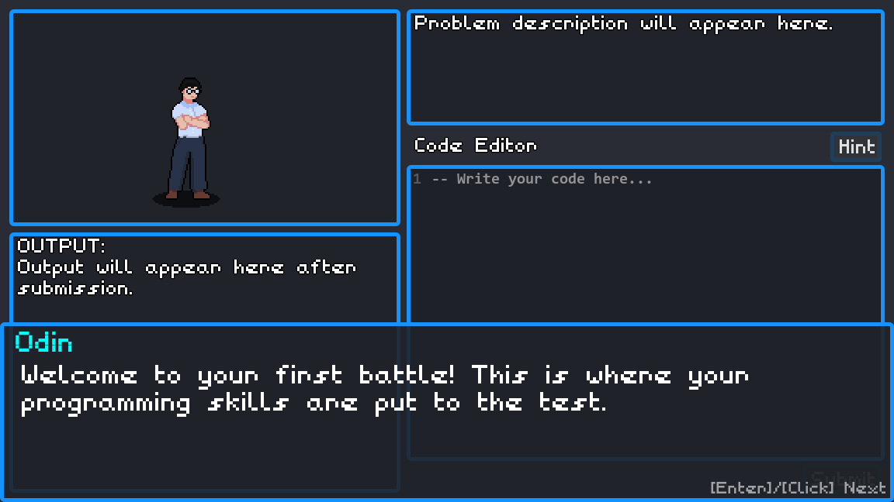
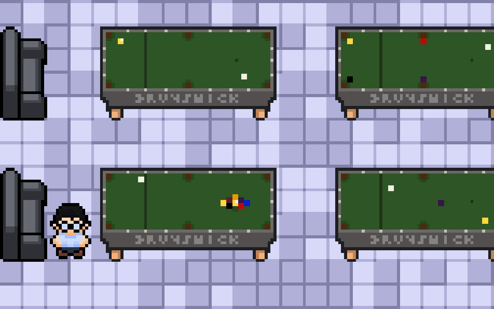
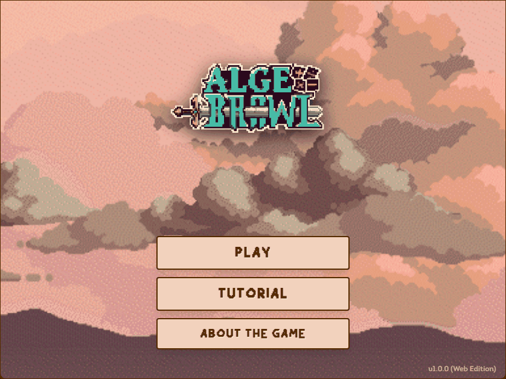

  
    
  
  
  

 

I'm a student developer from the Philippines and a DOST-SEI scholar. Most of what I build ends up being a game that teaches something: math, programming, or whatever I was struggling to learn at the time.

I like the part of a project where the "fun" layer and the "is this actually correct" layer have to meet. In practice that means a lot of Godot on the front and a lot of plain, deterministic code behind it.

I'm currently looking for a software engineering internship.

## What I've been building

### ODIN

**A tutoring system disguised as a dungeon crawler.** ODIN is my undergraduate thesis, built with three teammates as InsomniCode. It teaches C# arrays through a pixel-art RPG: you walk a dungeon, run into an enemy, and win the fight by writing real code in an in-game editor.

The interesting part is what happens after you hit submit. The game records how you typed (pauses, bursts, how much you changed between attempts) and sends it with your code to an ASP.NET Core backend. Roslyn parses the code to find the specific misconception, such as an off-by-one loop bound, and Bayesian Knowledge Tracing estimates how well you know the skill. The typing data tells a student who is thinking apart from one who is guessing or stuck, and the hint you get depends on which one you are.

`Godot 4` `GDScript` `ASP.NET Core 8` `PostgreSQL` `React`

 

 

### TAKO

**A math RPG that works without internet.** TAKO is an Android game for Grades 7 to 10, aligned with the DepEd curriculum and playable in English or Filipino. It was built for students who don't have reliable internet, so everything runs from a local SQLite database and syncs to Supabase only when a connection exists.

Gemini writes the questions and the feedback, but it never grades anything. Answers are checked by ordinary code that knows `1/2`, `0.5` and `2/4` are the same number, and wrong answers are matched to known mistakes before the AI is asked to explain them. If the AI is unreachable, the game falls back to templates and keeps going.

`Godot 4` `GDScript` `SQLite` `Supabase` `Gemini 2.5 Flash`

 

### Algebrawl

**Turn-based fights against famous mathematicians.** This started as a Java Swing project for a college class. I later ported it to the web so people could play it without installing anything. You battle Gauss, Newton and Fibonacci by solving problems, with KaTeX rendering the math and the Web Audio API generating the sound effects.

The original Java version is still in the repo.

`React 19` `TypeScript` `Vite` `Tailwind CSS` `KaTeX`

 

 

## Tools I reach for

<table>
  <tr>
    <td width="170"><b>Games</b></td>
    <td width="210"></td>
    <td>Godot 4, GDScript</td>
  </tr>
  <tr>
    <td width="170"><b>Web</b></td>
    <td width="210">&nbsp;&nbsp;&nbsp;</td>
    <td>TypeScript, React, Vite, Tailwind CSS</td>
  </tr>
  <tr>
    <td width="170"><b>Backend and data</b></td>
    <td width="210">&nbsp;&nbsp;&nbsp;&nbsp;</td>
    <td>C#, ASP.NET Core, PostgreSQL, SQLite, Supabase</td>
  </tr>
  <tr>
    <td width="170"><b>Also comfortable in</b></td>
    <td width="210">&nbsp;&nbsp;</td>
    <td>Java, Python, C++</td>
  </tr>
</table>

## Other things

- DOST-SEI Scholar
- PMI Project Management Ready, Project Management Institute
- Python developer certification

 

  The header is ODIN's in-game dialogue box. Pixel font: PIXY by 2DFUNS Studio (CC BY 3.0).

